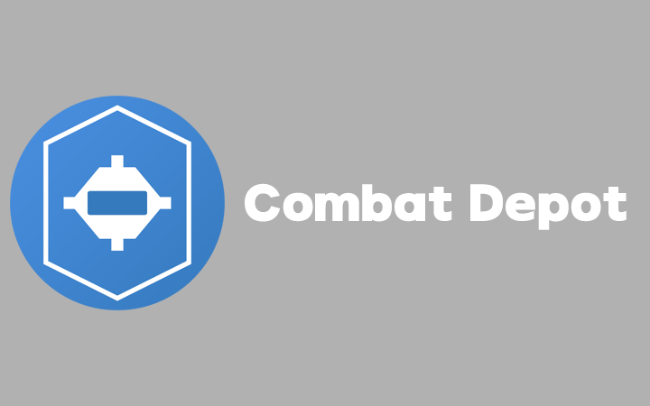

# Combat Depot - 一个自定义发放物品的库

 

    
    <h2 align="center">Combat Depot</h2>
    
一个可自定义化的物品浏览器，依靠外部存储来自定义化你的物品发放系统。

<!--  -->

<!-- [Bluecraft 程序开发部 QQ 群组](https://qm.qq.com/q/UTIXXOqOEq)，欢迎加入和讨论！ -->

求Star喵⭐

## 功能

### 一、发放、浏览功能

在创造模式物品栏和 `/give` 均可以获取本模组的终端，本模组的终端是核心物件，在后续将会推出指令打开 GUI 的功能（可禁用）。

首先打开终端，打开左上角的配置页面，你会看到很多按钮，这些是每个卡片的配置按钮。

一个终端有很多卡片，每个卡片有不同的存储，卡片做到了分类、分页的功能。

默认呈现的是 “主武器” 卡片，我们点进主武器的配置按钮，点进去会看到主武器的物品存储（和分页），我们点击按钮可以切换页面以浏览存储中的物品。

如果你想添加物品，以下是操作方法：

### 二、编辑物品操作方法

点击 “编辑配置” 按钮，进入编辑卡片配置页面，上面的第一个输入框要求你输入物品的命名空间（示例：`minecraft:diamond`），第二个输入框要求你输入物品的数量（命名空间必选，输入物品槽可选），第三个输入槽要求你输入你要添加的物品槽，第四个按钮上面有 “D” 字母，是按照后面槽位索引的逻辑来删除输入的槽位索引的槽位物品，第四个输入框输入你想添加/删除的槽位索引，第五个带 “+” 号按钮是添加按钮，可以添加上面命名空间和下面输入槽的物品。

如果你想添加一个物品，可以点击下面的物品栏的物品来选取进输入槽，然后输入你想放入的槽位索引（从 0 开始到 ... ，比如我想添加的槽位是第一个槽位，我就输入 0），点击 “+” 号按钮，你就可以添加了！

---

# "欢迎使用作战仓库，一个基于卡片系统的战斗物品管理器,让你的 Minecraft 装备管理更有条理,更具可玩性。"​

## 🌟 主要特性​

* 自定义卡片系统,支持通过配置文件添加新的卡片类型
* 支持游戏内编辑卡片存储
* 支持多种卡片：主武器、副武器、弹药、配件等
* 每种卡片有独立的物品栏和界面
* 支持拖拽物品管理
* 权限管理系统
* 完整的多语言支持
* 支持自定义卡片材质
* 界面美观,操作简单直观

## 💻 使用说明​

* 安装模组后,在游戏中使用通用终端(General Terminal)打开战斗仓库界面
* 界面顶部显示所有可用的卡片类型,点击切换不同卡片
* 管理员(`/op`)可以通过配置界面添加/移除物品
* 普通玩家可以拖拽物品进行管理,每个物品格子只能取用一次，死亡后将重置状态并可以再次取出一次

## 🛠 配置说明​

模组的配置文件位于: `.minecraft/config/combatdepot/cards.json`

你可以在配置文件中:

* 启用/禁用默认卡片
* 添加新的卡片类型
* 修改卡片的容量大小
* 自定义卡片材质路径

添加自定义卡片材质:​

1. 将材质文件(`.png` 格式)放入 `.minecraft/config/combatdepot/card_textures` 目录
2. 材质建议大小为 `32x16` 像素
3. 材质文件名将作为卡片 ID
4. 重启游戏后模组会自动加载新材质并创建对应配置

## 🔧 技术要求​

* Minecraft: 1.20+
* Forge: 47.1.0+
* Java: 17+

## 📝 使用许可​

本模组基于 GNU General Public License v3.0 (GPL v3) 开源发布。这意味着你可以:

* 自由使用、修改和分发此模组
* 将修改后的版本用于商业用途
* 将此模组与其他模组一起使用

但你必须:

* 在分发时包含源代码或提供获取源代码的方式
* 保留原始版权信息
* 使用相同的 GPL v3 协议发布修改后的版本
* 注明对代码的重要修改

## 🔗 相关链接​

[问题反馈](https://github.com/Bluecraft-Server/CompatDepot/issues)

## 📞 联系我们​

如果你在使用过程中遇到任何问题,或者有好的建议,欢迎通过以下方式联系:

* 我们的开发组QQ群: 778454105
* 主要负责人QQ号：2149720295

## 💡 计划功能​

* 支持更多类型的卡片
* 增加卡片动画效果
* 添加更多自定义选项
* 优化界面交互体验

## ❔ 如何下载​

1. 在我们的 GitHub 仓库里，找到工作流（Actions）
2. 注意右边工作流末尾的分支，那是你想要下载的mod的游戏版本，例如：`1.20.1-Forge`
3. 每次我们 push 的时候，都会在工作流部署一个构建版本，你只需要点击最新版本就行
4. 点击对应工作流后，下面的 Artifacts 工件就是你要下载的部署的版本了
5. 下载后的名称是部署时自动生成的，如果你需要重命名请把 “BM-Updater” 重命名成 Mod 名称就行

## 🤝 贡献​

欢迎你提交 Issue 和 Pull Request 来帮助改进这个模组!
